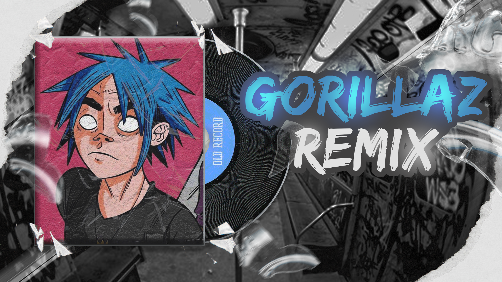
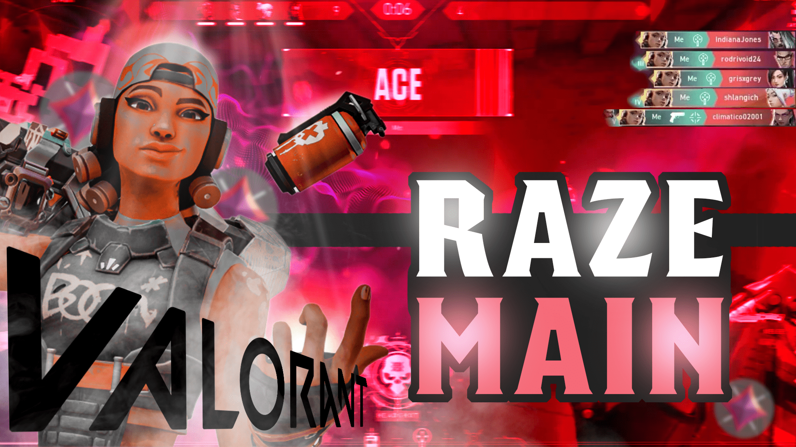

# My_Prjs_Photoshop_Illustrator

Welcome to my **Photoshop and Illustrator** design portfolio! 🎨 This repository showcases a collection of my design projects created using **Adobe Photoshop** and **Adobe Illustrator**. Below, you'll find various images that represent my work, including digital artwork, edits, and graphic designs.

---

## Project Overview

This repository contains a variety of works that highlight my skills in graphic design, photo manipulation, and illustration. These projects reflect my creativity and proficiency in using Adobe tools to create visually appealing content.

---

## Featured Works

### Image Gallery:

Below are some of the images showcasing my design work. Click on the thumbnails to view full-sized versions:

---

## Programs Used

These designs were created using industry-standard software tools for graphic design and digital artwork. Each program serves a specific purpose to bring my creative visions to life.

- **Adobe Photoshop**  
  A powerful tool for photo manipulation, digital painting, and design. Used extensively for creating high-quality edits, graphics, and visual effects.

- **Adobe Illustrator**  
  The go-to vector graphics software for creating logos, illustrations, and scalable artwork. Perfect for clean and crisp lines in complex design projects.

These programs have been essential in my workflow, allowing me to produce high-quality digital content for various design needs. From photo editing and composition in Photoshop to vector-based work and illustrations in Illustrator, I leverage these tools to create standout designs.

---

### Tools in Action

  
  

---

## PSD File Information

The PSD files associated with some designs may be large. If you need access to any of the original files, please don't hesitate to contact me directly.

### Contact Information:
- [Instagram: @oussama._.farah](https://www.instagram.com/oussama._.farah/)

---

## Get In Touch

I’m open to collaborations, freelance work, or design inquiries. Feel free to reach out to me if you’d like to discuss any of the designs or need custom artwork created with Adobe Photoshop and Illustrator.

---

## License

This repository is for showcasing my personal work and is not intended for commercial use unless specified. All designs are copyrighted and belong to me. Please do not use or redistribute without permission.
